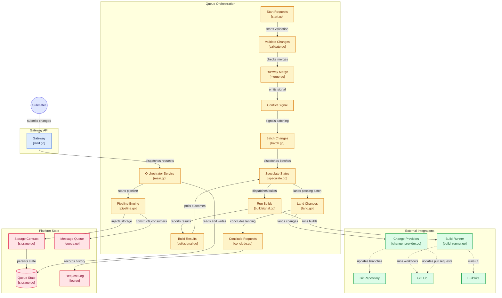

# Orchestrator Workflow

The orchestrator processes land requests through a queue-driven pipeline of small, single-purpose controllers. The gateway accepts a request over RPC and hands it off asynchronously; from there each controller consumes one topic, advances the request or batch, and publishes to the next topic. Most hops carry only an ID — the controller fetches the entity from storage — while a few entry points (`start`, `buildsignal`, `log`) carry the full payload because there is no row to fetch yet. Some stages cross a service boundary: they publish a full payload to the other service's queue and consume a full payload back, because neither service can read the other's storage. The `validate` and `land` stages adapt SubmitQueue's land work to Runway's `MergeRequest` contract and consume `MergeResult` on `landconflictsignal` / `landsignal`. See the queue-payload-boundary rule in [AGENTS.md](../../../AGENTS.md).

The pipeline has two cycles: `speculate → build → buildsignal → speculate` (CI feedback loop) and `land → runway → landsignal → speculate` (land the batch out of process, then advance the next). `conclude` is the only stage that transitions a request to a terminal state; `log` is an append-only sink that any controller can publish to via `submitqueue/core/request.PublishLog`.

## Diagram

[View Diagram](https://gitdiagram.com/uber/submitqueue)

## Per-controller summary

| Controller | In | Out | One-line role |
|---|---|---|---|
| **gateway/Land** | RPC | start | Accept request, mint ID, log Accepted, hand off async |
| **start** | LandRequest | validate, log | Persist Request and emit Started log |
| **validate** | RequestID | merge-conflict-check (Runway) | Dedup, fetch change metadata, claim changes, then adapt and publish the full `MergeRequest` to Runway (keyed by the request id, the correlation id) |
| **landconflictsignal** | MergeResult | batch | Correlate Runway's result; advance if landable, fail if conflicted |
| **batch** | RequestID | speculate | Group request into a Batch with dependencies |
| **speculate** | BatchID | build, land | (stub) Decide whether to verify via CI or land |
| **build** | BatchID | buildsignal | Trigger CI build for the batch |
| **buildsignal** | Build | speculate | Feed CI result back into speculation |
| **land** | BatchID | runway-merge (Runway) | Build the full land request from the batch's member requests, adapt it to `MergeRequest`, and publish to Runway keyed by the batch id (the correlation id) |
| **landsignal** | MergeResult | conclude, speculate | Correlate Runway's result; mark the batch Succeeded/Failed and fan out |
| **conclude** | BatchID | — | Map terminal batch state to request state |
| **log** | RequestLog | — | Gateway-owned sink: persists request log events to storage |

## DLQ reconciliation

Every *consumed* primary pipeline topic above is paired with a `{topic}_dlq` subscription consumed by a dedicated DLQ controller. The `log` topic is the exception: the orchestrator only publishes to it (the gateway is the sole consumer that persists the request log), so it has no orchestrator-side subscription and therefore no DLQ. The consumer framework moves a message to its DLQ once the primary controller returns a non-retryable error or exhausts retries on a retryable one; without the DLQ side the affected request would stay in a non-terminal state forever and the gateway would still report it as "in progress".

The DLQ controllers do not re-attempt the failed work. They decode the payload to recover the affected request (`RequestID`) or batch (`BatchID`) and drive the entity to a terminal failed state — `RequestStateError` for requests, `BatchStateFailed` for batches, with fan-out to the member requests. A DLQ whose topic carries a full payload rather than a bare ID recovers the id from that payload instead — the `landconflictsignal` and `landsignal` DLQs read it from the Runway `MergeResult` the producer echoed back. State writes use the same optimistic-locking CAS as the primary pipeline, so a late primary-pipeline update wins cleanly and a version mismatch is asked back for redelivery.

DLQ consumers are wired with `errs.AlwaysRetryableProcessor` and a very high `Retry.MaxAttempts`, with their own DLQ disabled. That combination makes reconciliation effectively non-droppable: any failure is forced retryable rather than escalating to a second-level dead-letter that nobody consumes. The trade-off is that a genuinely unprocessable DLQ message — typically a malformed payload — must be removed by an operator.

See `submitqueue/orchestrator/controller/dlq/README.md` for the design constraints (simplest possible implementation, reconcile-only, no recovery) and the per-topic controller mapping.

## Ownership by service

Each service owns its own data; the gateway and orchestrator never touch each other's, and the only thing they share is the messaging queue.

### Gateway

The gateway is the RPC entry point and the owner of the request log. It accepts requests, hands them to the orchestrator over the queue, and owns the record of what happened to each request — the only service that reads or writes the request log. It writes that record both directly, as requests arrive, and by consuming the log events the orchestrator emits.

### Orchestrator

The orchestrator runs the pipeline that advances a request from acceptance to a terminal state. It owns the working state of that pipeline — requests, batches, builds, and their bookkeeping — and is the only service that writes it. It drives a request through a series of internal stages, re-entering speculation as CI results arrive and as batches advance.

### Shared: the messaging queue

The two services communicate only through the messaging queue. It is pluggable infrastructure kept in its own database, separate from either service's application data: the gateway publishes incoming requests for the orchestrator to consume, and the orchestrator publishes log events for the gateway to consume.

## Request-log ownership invariant

The request log has exactly one owner: the **gateway**. The orchestrator only emits log events onto the queue; it never persists them. The gateway is the sole consumer of those events and the only writer of the request log.

This keeps all request-log writes in one service: the orchestrator stays a pure pipeline that emits events, and the gateway owns the request log end to end.
