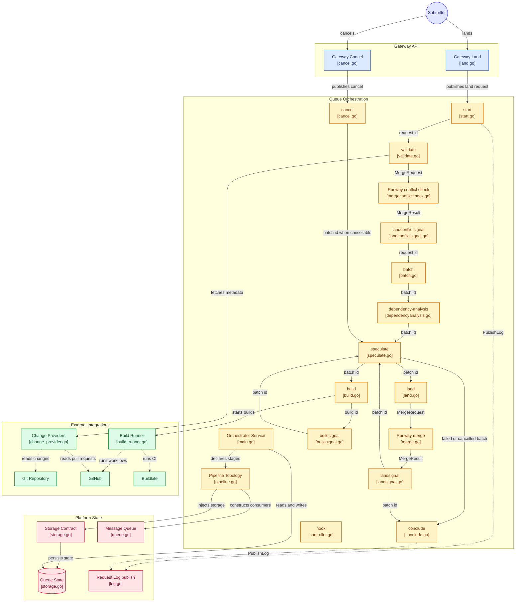

# Orchestrator Workflow

The orchestrator processes land requests through the queue-driven pipeline declared in [`submitqueue/orchestrator/pipeline.go`](../../../submitqueue/orchestrator/pipeline.go). The gateway accepts a land over RPC and publishes the full request to `start`; cancel is a separate RPC that persists `cancelling` and then publishes to `cancel`. Each controller consumes one topic, reloads what it needs, and publishes the next hop. Inside the orchestrator most hops carry only an ID. The hops that cross into Runway do not: `validate` and `land` publish a full `MergeRequest`, and `landconflictsignal` and `landsignal` consume the `MergeResult` Runway publishes back, because neither service can read the other's storage. Request-log entries are full payloads published with `submitqueue/orchestrator/core/request.PublishLog`; the gateway consumes that topic and is the only writer of the request log. `log`, Runway's `merge-conflict-check`, and Runway's `runway-merge` are publish-only on the orchestrator. See the queue-payload-boundary rule in [AGENTS.md](../../../AGENTS.md).

Two cycles re-enter speculation. `speculate` dispatches funded paths to `build`; `build` starts each pending path and publishes the build id to `buildsignal`; `buildsignal` polls with `delivery.Hold` and, when the status changes, publishes the batch id back to `speculate`. A batch that can land is published to `submitqueue-land`, which sends the merge request to Runway; `landsignal` correlates the result, marks the batch Succeeded or Failed, and fans out to `conclude` and `speculate`. `speculate` also publishes Failed and Cancelled batches straight to `conclude`.

Terminal request states are not `conclude`'s alone. `cancel` completes a request that has not been enrolled in a batch. `landconflictsignal` fails a request Runway reports as conflicted. `conclude` maps a terminal batch onto its member requests. The DLQ reconcilers force a failed terminal state when a consumed stage cannot finish.

The same `Stages` table registers a `submitqueue-hook` stage, outside the order of the flow above. It consumes hook events and invokes the wired hooks, and it publishes nothing onward. No orchestrator controller publishes a hook event; `service/submitqueue/orchestrator/server` resolves every event to noop. The comment on that row in `pipeline.go` is the contract: any stage can publish there.

## Diagram

[View Diagram](https://gitdiagram.com/uber/submitqueue)

```mermaid
flowchart TD

subgraph group_gateway["Gateway API"]
  node_gateway["Gateway Land<br/>[land.go]"]
  node_gatewaycancel["Gateway Cancel<br/>[cancel.go]"]
end

subgraph group_orchestration["Queue Orchestration"]
  node_orchestrator["Orchestrator Service<br/>[main.go]"]
  node_pipeline["Pipeline Topology<br/>[pipeline.go]"]
  node_start["start<br/>[start.go]"]
  node_cancel["cancel<br/>[cancel.go]"]
  node_validate["validate<br/>[validate.go]"]
  node_runwaycheck["Runway conflict check<br/>[mergeconflictcheck.go]"]
  node_conflictsignal["landconflictsignal<br/>[landconflictsignal.go]"]
  node_batch["batch<br/>[batch.go]"]
  node_dependency["dependency-analysis<br/>[dependencyanalysis.go]"]
  node_speculate["speculate<br/>[speculate.go]"]
  node_build["build<br/>[build.go]"]
  node_buildsignal["buildsignal<br/>[buildsignal.go]"]
  node_land["land<br/>[land.go]"]
  node_runwaymerge["Runway merge<br/>[merge.go]"]
  node_landsignal["landsignal<br/>[landsignal.go]"]
  node_conclude["conclude<br/>[conclude.go]"]
  node_hook["hook<br/>[controller.go]"]
end

subgraph group_integrations["External Integrations"]
  node_changeproviders["Change Providers<br/>[change_provider.go]"]
  node_buildrunner["Build Runner<br/>[build_runner.go]"]
  node_gitrepository["Git Repository"]
  node_github["GitHub"]
  node_buildkite["Buildkite"]
end

subgraph group_platform["Platform State"]
  node_storagecontract["Storage Contract<br/>[storage.go]"]
  node_queuestorage[("Queue State<br/>[storage.go]")]
  node_requestlog["Request Log publish<br/>[log.go]"]
  node_messagequeue["Message Queue<br/>[queue.go]"]
end

node_submitter(("Submitter"))

node_submitter -->|"lands"| node_gateway
node_submitter -->|"cancels"| node_gatewaycancel
node_gateway -->|"publishes land request"| node_start
node_gatewaycancel -->|"publishes cancel"| node_cancel
node_orchestrator -->|"declares stages"| node_pipeline
node_pipeline -->|"constructs consumers"| node_messagequeue
node_pipeline -->|"injects storage"| node_storagecontract
node_start -->|"request id"| node_validate
node_validate -->|"MergeRequest"| node_runwaycheck
node_validate -->|"fetches metadata"| node_changeproviders
node_runwaycheck -->|"MergeResult"| node_conflictsignal
node_conflictsignal -->|"request id"| node_batch
node_batch -->|"batch id"| node_dependency
node_dependency -->|"batch id"| node_speculate
node_cancel -->|"batch id when cancellable"| node_speculate
node_speculate -->|"batch id"| node_build
node_speculate -->|"batch id"| node_land
node_speculate -->|"failed or cancelled batch"| node_conclude
node_build -->|"starts builds"| node_buildrunner
node_build -->|"build id"| node_buildsignal
node_buildrunner -.->|"runs CI"| node_buildkite
node_buildrunner -.->|"runs workflows"| node_github
node_buildsignal -->|"batch id"| node_speculate
node_land -->|"MergeRequest"| node_runwaymerge
node_runwaymerge -->|"MergeResult"| node_landsignal
node_landsignal -->|"batch id"| node_conclude
node_landsignal -->|"batch id"| node_speculate
node_start -.->|"PublishLog"| node_requestlog
node_conclude -.->|"PublishLog"| node_requestlog
node_changeproviders -.->|"reads changes"| node_gitrepository
node_changeproviders -.->|"reads pull requests"| node_github
node_storagecontract -->|"persists state"| node_queuestorage
node_orchestrator -->|"reads and writes"| node_queuestorage

click node_gateway "https://github.com/uber/submitqueue/blob/main/submitqueue/gateway/controller/land.go"
click node_gatewaycancel "https://github.com/uber/submitqueue/blob/main/submitqueue/gateway/controller/cancel.go"
click node_orchestrator "https://github.com/uber/submitqueue/blob/main/service/submitqueue/orchestrator/server/main.go"
click node_pipeline "https://github.com/uber/submitqueue/blob/main/submitqueue/orchestrator/pipeline.go"
click node_start "https://github.com/uber/submitqueue/blob/main/submitqueue/orchestrator/controller/start/start.go"
click node_cancel "https://github.com/uber/submitqueue/blob/main/submitqueue/orchestrator/controller/cancel/cancel.go"
click node_validate "https://github.com/uber/submitqueue/blob/main/submitqueue/orchestrator/controller/validate/validate.go"
click node_runwaycheck "https://github.com/uber/submitqueue/blob/main/runway/controller/mergeconflictcheck/mergeconflictcheck.go"
click node_conflictsignal "https://github.com/uber/submitqueue/blob/main/submitqueue/orchestrator/controller/landconflictsignal/landconflictsignal.go"
click node_batch "https://github.com/uber/submitqueue/blob/main/submitqueue/orchestrator/controller/batch/batch.go"
click node_dependency "https://github.com/uber/submitqueue/blob/main/submitqueue/orchestrator/controller/dependencyanalysis/dependencyanalysis.go"
click node_speculate "https://github.com/uber/submitqueue/blob/main/submitqueue/orchestrator/controller/speculate/speculate.go"
click node_build "https://github.com/uber/submitqueue/blob/main/submitqueue/orchestrator/controller/build/build.go"
click node_buildsignal "https://github.com/uber/submitqueue/blob/main/submitqueue/orchestrator/controller/buildsignal/buildsignal.go"
click node_land "https://github.com/uber/submitqueue/blob/main/submitqueue/orchestrator/controller/land/land.go"
click node_runwaymerge "https://github.com/uber/submitqueue/blob/main/runway/controller/merge/merge.go"
click node_landsignal "https://github.com/uber/submitqueue/blob/main/submitqueue/orchestrator/controller/landsignal/landsignal.go"
click node_conclude "https://github.com/uber/submitqueue/blob/main/submitqueue/orchestrator/controller/conclude/conclude.go"
click node_hook "https://github.com/uber/submitqueue/blob/main/platform/hook/controller.go"
click node_changeproviders "https://github.com/uber/submitqueue/blob/main/submitqueue/extension/changeprovider/change_provider.go"
click node_buildrunner "https://github.com/uber/submitqueue/blob/main/submitqueue/extension/buildrunner/build_runner.go"
click node_storagecontract "https://github.com/uber/submitqueue/blob/main/submitqueue/extension/storage/storage.go"
click node_queuestorage "https://github.com/uber/submitqueue/blob/main/submitqueue/orchestrator/extension/storage/mysql/storage.go"
click node_requestlog "https://github.com/uber/submitqueue/blob/main/submitqueue/orchestrator/core/request/log.go"
click node_messagequeue "https://github.com/uber/submitqueue/blob/main/platform/extension/messagequeue/queue.go"

classDef toneNeutral fill:#f8fafc,stroke:#334155,stroke-width:1.5px,color:#0f172a
classDef toneBlue fill:#dbeafe,stroke:#2563eb,stroke-width:1.5px,color:#172554
classDef toneAmber fill:#fef3c7,stroke:#d97706,stroke-width:1.5px,color:#78350f
classDef toneMint fill:#dcfce7,stroke:#16a34a,stroke-width:1.5px,color:#14532d
classDef toneRose fill:#ffe4e6,stroke:#e11d48,stroke-width:1.5px,color:#881337
classDef toneIndigo fill:#e0e7ff,stroke:#4f46e5,stroke-width:1.5px,color:#312e81
classDef toneTeal fill:#ccfbf1,stroke:#0f766e,stroke-width:1.5px,color:#134e4a
class node_gateway,node_gatewaycancel toneBlue
class node_orchestrator,node_pipeline,node_start,node_cancel,node_validate,node_runwaycheck,node_conflictsignal,node_batch,node_dependency,node_speculate,node_build,node_buildsignal,node_land,node_runwaymerge,node_landsignal,node_conclude,node_hook toneAmber
class node_changeproviders,node_buildrunner,node_gitrepository,node_github,node_buildkite toneMint
class node_storagecontract,node_queuestorage,node_requestlog,node_messagequeue toneRose
class node_submitter toneIndigo
```

`hook` is drawn with the other stages because the topology registers it. Nothing in the orchestrator publishes to it, so the diagram has no edge into that node.

## Per-controller summary

| Controller | In | Out | One-line role |
|---|---|---|---|
| **gateway/Land** | RPC | start | Mint the request id, persist an accepting receipt, publish the full land request, then persist Accepted |
| **gateway/Cancel** | RPC | cancel | Persist `cancelling` for an existing land, then publish the cancel request |
| **start** | LandRequest | validate, log | Persist the Request and publish it to validate |
| **cancel** | CancelRequest | log, or speculate | Record Cancelling. Finish a request that has no applicable batch. Hand each cancellable batch attempt to speculate. Leave a Landing or already-terminal batch for conclude |
| **validate** | RequestID | merge-conflict-check (Runway), log | Dedup, fetch change metadata, claim changes, then publish the full `MergeRequest` to Runway keyed by the request id |
| **landconflictsignal** | MergeResult | batch, or log | Correlate Runway's check; advance a landable request to batch, or fail a conflicted request |
| **batch** | RequestID | dependency-analysis, log | Mint a Creating batch for the request and hand that batch id onward |
| **dependency-analysis** | BatchID | speculate, log | Enrol the request, resolve what the batch serializes behind, and promote it from Creating to Created |
| **speculate** | BatchID | build, submitqueue-land, conclude | Treat the message as a dirty signal for the queue: admit Created batches, commit outcomes from facts already known, ask the speculator which paths to fund, and dispatch builds, a land, or conclude |
| **build** | BatchID | buildsignal | Start a build for each pending path on the head and publish that build id |
| **buildsignal** | BuildID | speculate | Poll `BuildRunner.Status`, stop a build whose path no longer wants it, and wake speculate when the status changes. In-flight polls `Hold` the same delivery |
| **land** | BatchID | runway-merge (Runway), log | Build the full land request from the batch's member requests, adapt it to `MergeRequest`, and publish it to Runway keyed by the batch id |
| **landsignal** | MergeResult | conclude, speculate | Correlate Runway's merge result, mark the batch Succeeded or Failed, and fan out |
| **conclude** | BatchID | log | Map the batch's terminal state onto its member requests |
| **hook** | HookEvent | — | Invoke the hooks the resolver returns for the event. Publishes nothing onward |
| **log** | RequestLog | — | Gateway-owned sink: persists request log events. The orchestrator only publishes to this topic |

`speculate` is the decision stage, not a stub. A run reloads the queue's in-flight batches and path sets, admits anything still in Created, finalizes outcomes, and only then asks the speculator for proposals. Path-set changes are persisted before the build dispatch. The package doc in `submitqueue/orchestrator/controller/speculate` is the model of paths, budgets, and bypass.

## DLQ reconciliation

Every consumed stage in `pipeline.go` is paired with a `{topic}_dlq` subscription. `pipeline.Construct` registers that companion with `errs.AlwaysRetryableProcessor` and `DLQSubscriptionConfig`, which disables a second-level DLQ and sets `Retry.MaxAttempts` to 0 (unlimited). The consumer moves a message to its DLQ once the primary controller returns a non-retryable error or exhausts retries on a retryable one. The publish-only topics — `log`, Runway `merge-conflict-check`, and Runway `runway-merge` — have no orchestrator subscription and therefore no orchestrator DLQ. The gateway consumes `log`. Runway consumes the two merge request topics.

Most DLQ controllers do not re-attempt the failed work. They decode the payload to a `RequestID` or `BatchID` and drive that entity to a terminal failed state — `RequestStateError` for requests, `BatchStateFailed` for batches, with fan-out to the member requests. Topics that carry a full payload recover the id from it: the `landconflictsignal` DLQ reads the request id from Runway's `MergeResult`, and the `landsignal` DLQ reads the batch id. The `buildsignal` DLQ decodes a build id, loads that build, and fails the batch that owns it. A missing build or an empty batch id is acked: there is no batch to fail from this signal. State writes use the same optimistic-locking CAS as the primary pipeline, so a late primary-pipeline update wins cleanly and a version mismatch is asked back for redelivery.

Two consumed stages do not follow that shape. The speculate DLQ fails the batches the failure attributes — often not the batch named on the message, because a run re-plans the whole queue — and then republishes to `speculate`, so one dead letter does not strand every other batch. The hook DLQ records the dropped event and acks. A hook never writes pipeline state, so there is no request or batch to fail; republishing the logged event is how an operator recovers the side effect. A genuinely unprocessable request or batch DLQ message, typically a malformed payload, must be removed by an operator, because those consumers retry until reconciliation succeeds.

See `submitqueue/orchestrator/controller/dlq/README.md` for the reconcile-only constraints. The speculate and hook controllers in that wiring are the exceptions to the generic request/batch mapping that README's table still summarizes.

## Ownership by service

Each service owns its own data. The gateway and orchestrator do not read each other's stores. They share the messaging queue, and the orchestrator shares Runway's merge topics with Runway.

### Gateway

The gateway is the RPC entry point and the owner of the request log. It accepts land and cancel requests, hands them to the orchestrator over the queue, and owns the record of what happened to each request — the only service that reads or writes the request log. It writes that record both directly, as requests arrive, and by consuming the log events the orchestrator emits.

### Orchestrator

The orchestrator runs the pipeline that advances a request from acceptance to a terminal state. It owns the working state of that pipeline — requests, batches, builds, speculation path sets, and their bookkeeping — and is the only service that writes it. It re-enters speculation as CI results arrive and as batches land or fail, and it asks Runway to check merge conflicts and to perform the land.

### Shared: the messaging queue

The gateway and orchestrator communicate through the messaging queue. It is pluggable infrastructure kept in its own database, separate from either service's application data: the gateway publishes land and cancel requests for the orchestrator to consume, and the orchestrator publishes log events for the gateway to consume. Merge requests and their results use the same queue machinery on Runway's topics.

## Request-log ownership invariant

The request log has exactly one owner: the **gateway**. The orchestrator only emits log events onto the queue, via `submitqueue/orchestrator/core/request.PublishLog`; it never persists them. The gateway is the sole consumer of those events and the only writer of the request log.

This keeps all request-log writes in one service: the orchestrator stays a pipeline that emits events, and the gateway owns the request log end to end.

## Resource IDs

A request or batch ID is the canonical decimal string of a positive value from the durable counter extension (`platform/extension/counter`), scoped to `(queue, domain)`, where the domain is `request` or `batch`. The gateway mints the request ID in `Land`, and `batch` mints the batch ID when it creates a batch. Stovepipe mints its request IDs the same way against its own storage. Stores accept the caller's ID and never generate one.

An ID is unique only within its queue and kind, so `42` can name a request in two queues, or both a request and a batch in one. APIs, messages, and storage keys therefore carry the queue separately, and the queue leads every primary key; the field or message type supplies the kind. An ID never embeds its scope, so forms such as `demo-queue/42` and `demo-queue/batch/7` are rejected. `platform/base/id` owns the format: it accepts only the canonical decimal form of a positive int64, with no sign or leading zeros, and compares IDs numerically, never lexicographically.

The first value is `1`. Values are never reused, and a failed write may leave a gap. IDs are strings in storage and on the wire; only the counter stores integers. Change URIs ([change-uri.md](../change-uri.md)), build IDs, message IDs, and hook IDs are not counter-generated and keep their own contracts.

Rejected alternatives:

- **Scope prefixes such as `queue/42`.** They duplicate the queue every API already carries, lengthen keys, need parsing, and put separators into URL path segments.
- **ARN-style names.** They solve global lookup, which no API provides or needs.
- **UUIDs or one global counter.** They buy global uniqueness at the cost of readable IDs or cross-queue coordination.
- **Integer wire fields.** They would tie the API to the counter's representation without adding meaning.
- **SQL auto-increment, `MAX(id) + 1`, or process-local counters.** These put allocation inside one store, race under concurrency, or reuse IDs after a restart.
