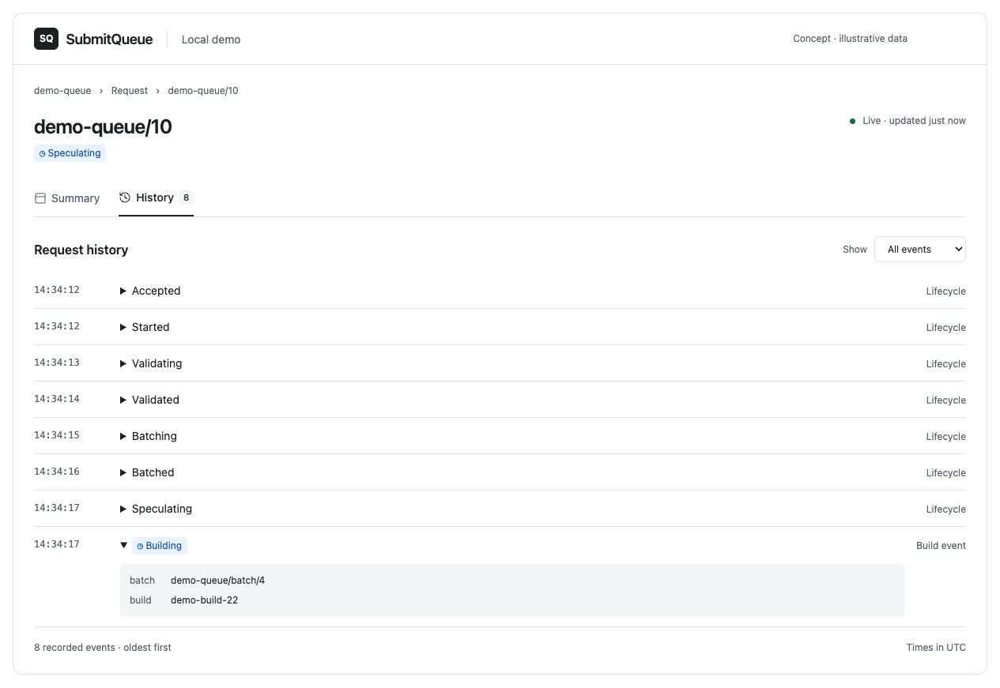

# Web as a Library

## Decision

SubmitQueue publishes its browser UX as a library of components, gateway helpers, and presentation models. A deployer-owned Next application supplies routes, authentication, telemetry, configuration, and gateway connectivity.

The package resembles `submitqueue/client/`, while the host resembles service wiring. The library consumes the published gateway contract and maps it to presentation. Domain extensions stay behind the gateway.

Phase one is read-only: request summary, history, and queue receipt list ([status/list](submitqueue/status-list-api.md), [history](submitqueue/history-api.md)). Mutations require a separate authorization and audit design.

## URL reference

The entry point lists gateway-configured queues through `ListQueues`, including empty queues, with each queue linking to its landing page. The queue is the top-level navigation context; resource IDs remain gateway-supplied values that the UI does not interpret.

| Resource or view | Route | Example | Availability |
|---|---|---|---|
| Queue directory | `/` | `/` lists queues returned by `ListQueues` | Reference host |
| Queue landing and request list | `/<queue>` | `/demo-queue` | Reference host |
| Request detail | `/<queue>/request/<request-id>` | `/demo-queue/request/10` | Reference host |
| Request history tab | `/<queue>/request/<request-id>?view=history` | `/demo-queue/request/10?view=history` | Reference host |
| Batch detail | `/<queue>/batch/<batch-id>` | `/demo-queue/batch/4` | Deferred; requires a batch read contract |
| GitHub logical change | `/<queue>/change/github/<host>/<org>/<repo>/pull/<pr>` | `/demo-queue/change/github/github.com/uber/submitqueue/pull/123` | Demo receipt-window scan; unbounded lookup deferred |
| Phabricator logical change | `/<queue>/change/phab/<host>/D<revision>` | `/demo-queue/change/phab/phabricator.example.com/D12345` | Demo receipt-window scan; unbounded lookup deferred |

The queue directory replaces the automatic redirect to `demo-queue`. The library maps queue models; the host fetches and validates them through the published gateway API, without inferring queues from received requests.

The request and batch examples follow [scoped sequential resource IDs](scoped-resource-ids.md): `"10"` and `"4"` are stored string IDs, and the route supplies their queue and resource context. The UI passes each ID unchanged to the gateway. The mockups below retain earlier illustrative slash-containing IDs; those labels do not override the scoped-ID contract.

Summary is the default request view; `?view=history` makes History shareable. Queue URLs stay clean: `/demo-queue` refreshes a rolling 24-hour window, while `/demo-queue?page=<opaque-cursor>` preserves a pagination snapshot without exposing `from`/`to`.

### Readable change links

Omit the SHA/diff ID for submissions across versions; include it for submissions of one exact version.

```text
/demo-queue/change/github/github.com/uber/submitqueue/pull/123
/demo-queue/change/github/github.com/uber/submitqueue/pull/123/<full-sha>
/demo-queue/change/phab/phabricator.example.com/D12345
/demo-queue/change/phab/phabricator.example.com/D12345/67890
```

Exact-version URLs mirror the [change URI](change-uri.md): replace `<scheme>://` with `/<queue>/change/<scheme>/`, preserving the authority and encoded path. Do not insert `commit` or `diff` segments.

The host resolves change identities; React components do not parse URIs. Pinned GitHub/Phabricator pages use exact-URI lookups. Across-version and git demo pages scan the displayed rolling window; fake file hints stay backend-only.

## Reference UX

Design mockups with illustrative data; the implementation displays gateway change URIs rather than placeholder titles.

### Queue landing page


Newest-first request table with displayed-page search, status, receipt times, and refresh controls.

### Request summary


Request identity and current status, with copy controls, changes, and expandable metadata.

### Request history



Chronological lifecycle and build events with type filters, errors, and expandable metadata.

### Change submission history


Submissions for a PR or revision, with version selection and separate status/history links for each request.

## Host/library boundary

| Library | Host |
|---|---|
| Gateway-to-presentation mapping, components, status and error display | Next application root, routes, and which subset to expose |
| Internal link helpers and a structural gateway-diagnostic hook | Queue names, per-queue gateway routing, credentials, deadlines, and the diagnostic backend |
| Serializable view models and polling controls | Session authorization, configuration, and process lifecycle |

The host configures the queues it serves and selects each generated client with `(queue) => client`. It builds those clients with `@connectrpc/connect-node` `createGrpcTransport` over HTTP/2: TLS by default, plaintext h2c only as an explicit local option. The host supplies the library's diagnostic hook and keeps the gateway reachable only by trusted hosts.

Components render serializable props and do not fetch. Sessions, gateway clients, and protobuf messages stay on the server. The library does not depend on Next.js: host routes call `connection()` before gateway I/O, render dynamically, and do not cache gateway results. The host supplies a refresh callback that completes only when its framework has finished refreshing the view.

`WebPaths` selects queue-scoped internal links. A queue landing page and request list live at `/<queue>` and a detail page at `/<queue>/request/<full-request-id>`. The `request` segment leaves room for other queue-scoped resources while the full request ID remains human-readable and opaque to the UI; the host's catch-all route only reassembles its URL path segments before passing it unchanged to the gateway. Phase one renders change URIs and build metadata as text; trusted external-link mapping and typed build URLs are deferred.

`List` requires a queue and a half-open receipt window. The host recalculates the default trailing 24-hour window on refresh and keeps the URL free of timestamps. Pagination preserves the original bounds inside a signed, queue-scoped cursor; refreshing an older page returns to the live first page.

A client component starts `router.refresh()` inside a React transition and does not schedule the next refresh until that transition finishes. The wait is the terminal client's poll interval plus jitter, grows across consecutive transport failures, and pauses while the document is hidden or the browser is offline. A request view normally stops only after the summary is terminal and successfully loaded history contains the same terminal status; it also stops when a terminal summary is paired with a non-retryable history error, because polling cannot make that authorization or request-shape failure converge. A queue list keeps polling for the life of its fixed window.

## Package shape

The web workspace lives under `web/`. Bazel owns the pinned Node toolchain, npm dependency graph, generated protobuf API, TypeScript compilation, tests, Next production build, OCI image, and browser E2E. The pnpm workspace metadata remains for optional editor and direct local-development workflows; Gazelle excludes `web/` because it contains no Go packages.

```
web/
├── api/                    # @submitqueue/api, one package for base and gateway stubs
├── submitqueue/            # @submitqueue/web-submitqueue
└── service/submitqueue/    # reference host
```

Generated TypeScript is committed beside the Go stubs. Gateway stubs and the base protos they import share one package, so the imports stay valid after publish. The library ships ESM at the root, `./server`, and `./testing`. The root preserves `'use client'` and reaches no `server-only` or Node-only code. React, Connect, and Protobuf-ES are peers; Next.js is a dependency of the reference host only. Shared UI waits until a second domain needs it.

## Shipped compatibility contracts

- Helpers classify `InvalidArgument`, `NotFound`, and `ResourceExhausted` as user errors, `Unavailable` and `DeadlineExceeded` as transient infrastructure errors, and every other code as an infrastructure error. Raw gateway messages are not rendered. A host-supplied diagnostic hook receives the operation, request identity, Connect code, and original cause on the server.
- Status values stay strings. The library has a display table and an unknown fallback.
- Protobuf `int64` timestamps become numeric milliseconds in presentation models after a safe-range check.

## Acceptance

- Vitest tests cover proto drift, timestamp conversion, stable list bounds, queue-scoped readable paths, error classification, host-controlled deadlines, structured diagnostics, readiness configuration, and polling controls including transition-aware single-flight, progressive backoff, hidden/offline pause, and history-aware terminal stop.
- Every protected host layout and route repeats the session check rather than relying only on `proxy.ts`.
- The Bazel target `//web/test/e2e:web_test` loads Bazel-built scratch OCI images for the grpc-go services, the Bazel-built web OCI image, and a digest-pinned MySQL image before running the stack as `e2e-submitqueue-web-*` with pulls and Dockerfile builds disabled. It covers the Basic-auth challenge, explicit h2c, newest-first list navigation, a slash-containing sqid, lifecycle/build history, and axe-core checks on list and detail pages.
- Bazel-built package tarballs are inspected and linked into an isolated TypeScript consumer that typechecks the root, `./server`, and `./testing` export map. The repository's Bazel-built Next 16 production host separately verifies framework integration.
- Deterministic gateway fakes ship only through the explicit `./testing` entry point, which the reference host does not import.

## Deferred

- Trusted change links and typed build-history links wait for a host-owned allowlist and a gateway field that distinguishes URLs from display metadata.
- OpenTelemetry interceptors and span APIs wait for a deployment that can establish naming and propagation conventions; phase one exposes only the structural diagnostic hook.
- A shared gateway status fixture waits until the wire contract owns status values rather than opaque strings.
- TLS transport E2E, responsive screenshot matrices, focus/scroll restoration, and the full supported React/Next version matrix are follow-up coverage. Phase one CI exercises h2c, axe-core, the pinned dependency set, and the declared package export surface.

## Rejected

- **A production application contract owned by this repository.** The checked-in app and OCI image are a local reference host; a production deployer still owns routes, authentication, telemetry, transport, and release policy.
- **Static export or embedding in a Go binary.** Request routes are dynamic, and the gateway stays private to a server that can authorize the caller.
- **A generic runtime, DI container, or web-extension layer.** Next's filesystem and the generated gateway client are the composition boundaries.
