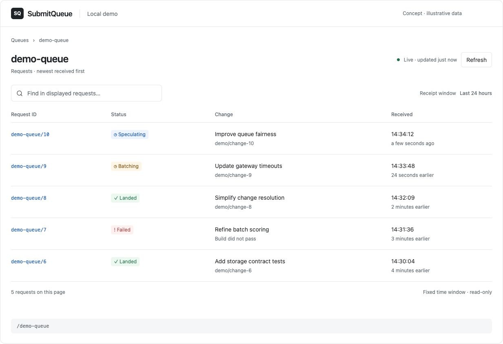
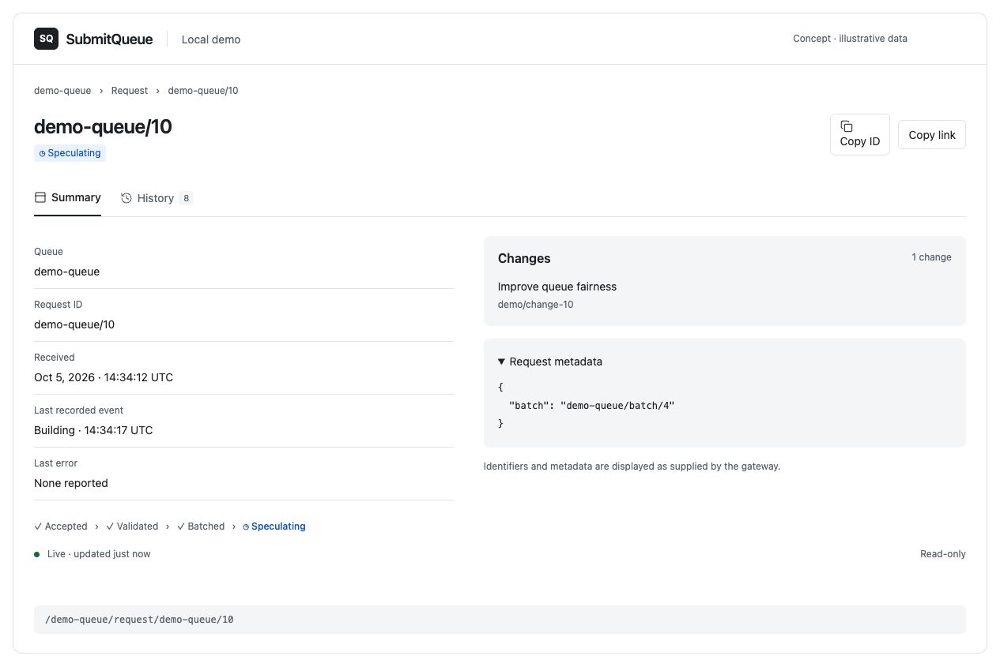
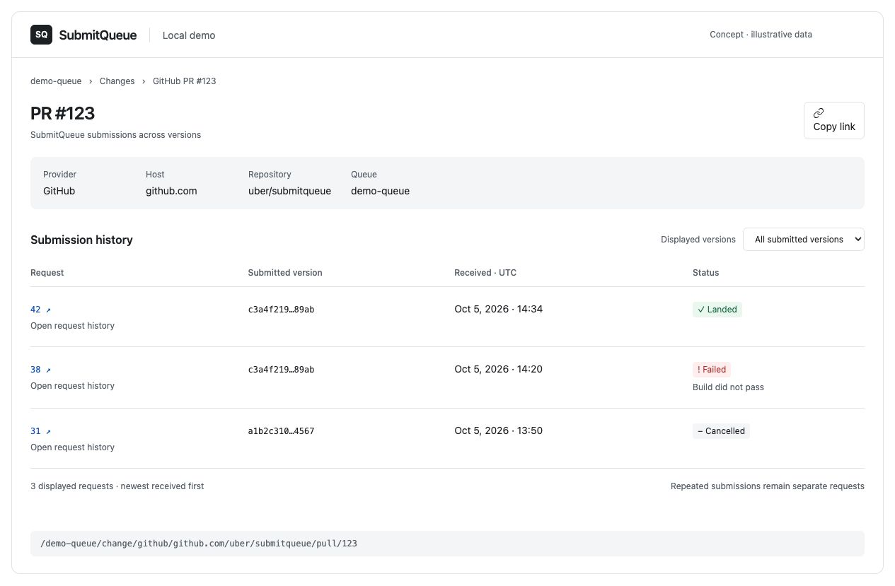

# Web UI as a Mountable Module

## Decision

SubmitQueue publishes its browser UX as a mountable module: routing, data loading, page models, pages, layout, styling, navigation, and polling ship together, so a host renders the complete experience rather than rebuilding it. A deployer-owned host, in any React-capable server framework, supplies identity, gateway transport, cursor signing keys, logging, metrics, tracing, and its framework's navigation.

The module resembles `submitqueue/client/`, and each host resembles service wiring. The module consumes the published gateway contract structurally and maps it to presentation. Domain extensions stay behind the gateway.

Phase one is read-only: request summary, history, and queue receipt list ([status/list](submitqueue/status-list-api.md), [history](submitqueue/history-api.md)). Mutations require a separate authorization and audit design.

## Architecture

Deployers already run web platforms of their own, with their own server framework, React major version, RPC client, protobuf runtime, and identity and telemetry. A single configurable application, as cadence-web is, cannot run inside such a platform, and anything deeper than configuration means a fork. The UI therefore ships as a module that any React server host mounts. The module owns the user experience; the host owns infrastructure.

```
host        web/service/submitqueue   routes, framework adapter, wiring (the main.go counterpart)
  │ mounts
module      web/submitqueue           routing, controllers, pages, styles for SubmitQueue
```

How a page is served:

1. The host routes every path to one catch-all page and authenticates the viewer.
2. The host calls the module's single `handle` entry with the path. The module strips its mount path, parses the still-encoded rest into a route, applies the host's optional authorization, assigns a request ID, and opens a span and a duration metric.
3. The module loads the route through its controllers and the gateway client the host injected.
4. The module returns a redirect, a not-found or forbidden decision, or a serializable page model; expected outcomes are never exceptions.
5. The host renders the model with the module's client app. In the browser, the app routes links, refresh, and polling through the host's router.

The boundaries are enforced, not just documented. The module imports no generated protobuf code, protobuf runtime, transport, or web framework, and its client entry never reaches its controllers or Node APIs. Only the host chooses implementations, including its gateway transport and its framework adapter. A package test scans every file in the built tarball for forbidden imports, and Bazel visibility keeps web targets inside `web/` and the generated bindings inside the host and the end-to-end test.

## Responsibilities

| Module | Host |
|---|---|
| Routing in both directions, catalog validation, request and change lookup, receipt windows, pagination, internal links | One catch-all route that hands the still-encoded path to the host pipeline |
| Serializable page models with titles, complete pages, shell, Base Web views and scoped layout styles, status and error states | Authentication, the principal it produces, and optional per-route authorization |
| Client navigation, refresh, and polling policy, expressed through a navigation adapter | The adapter: the framework's link, push, and refresh; the host owns the page model and history |
| The gateway contract, default error classification, cursor format, and instrumentation points | Gateway transport and credentials, cursor signing keys, logger, meter, tracer, configuration, and deployment |

Components render serializable props and never fetch; sessions, gateway clients, and protobuf messages stay on the server. A host that supplies no navigation adapter gets ordinary document navigation and manual refresh. The host supplies Base Web and Styletron providers and loads the module's scoped layout stylesheet, by importing it or by serving the file and linking to it. The module caches nothing unless the host configures a catalog cache keyed by viewer, and the host resolves the gateway per request when visibility depends on the viewer.

## URLs

The queue is the top-level navigation context. The directory lists the queues the gateway reports through `ListQueues`, including empty ones, rather than inferring queues from received requests.

| Page | Route | Example | Lookup |
|---|---|---|---|
| Queue directory | `/` | `/` | `ListQueues` |
| Queue and request list | `/<queue>` | `/demo-queue` | Rolling 24-hour receipt window |
| Request summary | `/<queue>/request/<request-id>` | `/demo-queue/request/10` | By request ID |
| Request history | `/<queue>/request/<request-id>?view=history` | `/demo-queue/request/10?view=history` | By request ID |
| GitHub change | `/<queue>/change/github/<host>/<org>/<repo>/pull/<pr>[/<sha>]` | `/demo-queue/change/github/github.com/uber/submitqueue/pull/123` | Exact URI when pinned to a SHA; otherwise the receipt window |
| Phabricator change | `/<queue>/change/phab/<host>/D<revision>[/<diff>]` | `/demo-queue/change/phab/phabricator.example.com/D12345` | Exact URI when pinned to a diff; otherwise the receipt window |
| Git ref change | `/<queue>/change/git/<host>/<repo>/<encoded-ref>[/<sha>]` | `/demo-queue/change/git/git.example.com/demo/refs%2Fheads%2Fmain` | The receipt window |
| Batch detail | `/<queue>/batch/<batch-id>` | `/demo-queue/batch/4` | Deferred until a batch read contract exists |

Request IDs follow [queue-scoped resource IDs](submitqueue/workflow.md#resource-ids): the route supplies the queue and resource kind, and the ID passes to the gateway unchanged. IDs stay readable and opaque in the path, and a dot-only segment gets a visible `~` escape so browsers cannot normalize it away.

Change pages mirror the [change URI](change-uri.md): replace `<scheme>://` with `/<queue>/change/<scheme>/`, keeping the authority and encoded path, with no `commit` or `diff` segments. Omitting the version shows every submitted version; including it pins one. Receipt-window scans read a bounded number of queue pages per request and continue through an opaque `?page=` cursor, and provider-only hints in change URIs never reach the URL.

Summary is the default request view, and `?view=history` makes History shareable. Queue URLs carry no timestamps: `/demo-queue` always shows the live window, and `/demo-queue?page=<cursor>` is a snapshot of an older page.

## Behavior

**Windows and pagination.** `List` takes a queue and a half-open receipt window. The module recalculates the trailing 24-hour window on refresh and keeps timestamps out of the URL. Older pages carry the original bounds in an opaque cursor, signed under a scope that names the page, so a cursor cannot be replayed elsewhere. The reference host signs with HMAC under a key separate from any viewer credential. Refreshing an older page returns to the live first page.

**Refresh and polling.** A refresh does not schedule the next until it has finished rendering. The wait is the poll interval plus jitter, grows across consecutive transport failures, and pauses while the document is hidden or the browser is offline. A request view stops once the summary is terminal and loaded history contains the same terminal status, or when a terminal summary pairs with a non-retryable history error that polling cannot fix. A queue list keeps polling for the life of its window. A change page that scans the receipt window refreshes only on request, because each render reads up to ten queue pages; a pinned version, found by one exact lookup, keeps polling.

**Errors and values.** Gateway failures map from gRPC status: invalid argument and resource exhausted are user errors, not found is a missing resource, unavailable and deadline exceeded are transient, and everything else is internal. A transport with another error shape supplies its own classifier. Raw gateway messages are logged, never rendered, and views keep the last good data on transient failures. Status values stay strings with a display table and an unknown fallback. `int64` values arrive as bigint, number, string, or `Long` and become milliseconds after a safe-range check.

**Theme.** Public Base Web components own controls, headings, status tags, and tables. The host supplies `BaseProvider` and the Styletron engine, including server style collection and browser hydration, so embedded pages inherit its light, dark, or custom theme. The remaining scoped stylesheet holds page layouts; private custom properties are derived from the active Base Web theme. The module supplies no provider or independent palette. React 18 and 19 are both supported.

## Observability and identity

Logging, metrics, and tracing are injected the way the Go services take zap and tally. The module accepts a pino logger, an OpenTelemetry meter, and an OpenTelemetry tracer, and default to a silent logger and the OpenTelemetry API's no-op providers. Every gateway read is timed and traced, and a failure is logged once under pino's `err` key with the request ID. The module times page loads too. The reference host logs with pino and exposes Prometheus metrics, from startup, only when a port is configured. It registers no tracer provider, so its spans are no-ops; a host that registers OpenTelemetry tracing can also add a gateway interceptor that propagates trace context. A host with another metrics client adapts it to the meter interface; if such adapters prove large, a smaller tally-shaped interface may replace it.

Identity has no shared library to depend on, so the host authenticates and passes an opaque principal. The module never sees credentials.

## Generated bindings

The repository publishes `.proto` sources. The module depends only on the structural shape of a gateway client, so a Protobuf-ES and Connect client satisfies it directly and any other client satisfies it through a thin adapter; a deployer with its own toolchain vendors the protos and generates its own bindings. Inside the repository, private generated TypeScript serves the reference host's gateway client and the end-to-end test, with a drift test against the sources, the same way Go's bindings serve both its server and its tests.

## Layout

The workspace lives under `web/` and repeats the Go root layout; the UI is a gateway client rather than a Go service, so the domain uses the single-service shape. Bazel owns the Node toolchain, dependency graph, generated bindings, compilation, tests, Next.js production build, OCI image, and browser E2E; the pnpm workspace exists for editors, and Gazelle excludes `web/`.

| Go | Web | Holds |
|---|---|---|
| `{domain}/entity`, `core`, `extension`, `controller` | `web/submitqueue/` | View models and load results, paths and routing, observability helpers, the gateway and cursor contracts with their fakes and HMAC codec, per-page controllers, plus `view/` for the app, pages, building blocks, and the stylesheet |
| `api/{domain}/{service}` | `web/api/` | Private generated bindings for the host and the E2E test |
| `service/{domain}/{service}` | `web/service/submitqueue/` | The reference host: `src/server` (wiring, free of Next.js), `src/next` (the Next.js adapter), `src/app` (routes) |

## Acceptance

- Unit tests cover route round-trips, readable paths, timestamp conversion, stable list bounds, cursor scoping and tampering, error classification and host classifiers, catalog caching, request-scoped logging, gateway and page metrics, mount paths and authorization, client navigation, and polling (transition-aware single flight, progressive backoff, hidden and offline pause, history-aware terminal stop).
- Every protected host layout and route repeats the authentication check rather than relying only on the Next.js proxy.
- `//web/test/e2e:web_test` runs the Bazel-built Go services, the Bazel-built web image, and a digest-pinned MySQL image with pulls and Dockerfile builds disabled. It covers the Basic-auth challenge, explicit h2c, newest-first lists, client-side navigation, a slash-containing request ID, lifecycle and build history, paginated change history, and axe checks.
- Built package tarballs are inspected for contents and forbidden imports, typechecked by a consumer written only against public entry points, rendered by a plain Node consumer through `handle`, and server-rendered and hydrated under React 18.

## Deferred

- Trusted change links and typed build-history links wait for a host-owned allowlist and a gateway field that distinguishes URLs from display metadata.
- TLS transport E2E, responsive screenshot matrices, focus and scroll restoration, and the full React and Next.js version matrix are follow-up coverage.

## Rejected

- **A single deployable application customized by configuration (cadence-web's model).** It cannot run inside a deployer's existing web platform, and customization beyond configuration means forking.
- **A shared platform package before a second module exists.** Splitting domain-free contracts and React building blocks into their own package adds a module registry, a second package boundary, and a stylesheet merge for a single consumer. They live in the module until another web module needs them.
- **Framework adapters in the module.** Each host owns its framework integration; the module stays framework-free, and the Next.js adapter lives with the reference host.
- **Logging, metrics, or authentication as module extensions.** Hosts already own those backends; the module accepts standard types instead, as the Go services accept zap and tally.
- **Client-side model fetching in the module.** Hosts' routers already own history and data loading, so the module asks the host to refresh or navigate instead of fetching page models itself.
- **An inline stylesheet for hosts that cannot import CSS.** Such hosts can serve the shipped file and link to it, which costs nothing extra.
- **A production application contract owned by this repository.** The host and OCI image are a local reference; a production deployer owns identity, telemetry, transport, and release policy.
- **Static export or embedding in a Go binary.** Request routes are dynamic, and the gateway stays private to a server that can authorize the caller.

## Appendix: reference UX

Design mockups with illustrative data. The implementation shows gateway change URIs rather than placeholder titles, and the mockups' slash-containing request IDs predate the scoped-ID contract above.

### Queue landing page



Newest-first request table with displayed-page search, status, receipt times, and refresh controls.

### Request summary



Request identity and current status, with copy controls, changes, and expandable metadata.

### Request history


Chronological lifecycle and build events with type filters, errors, and expandable metadata.

### Change submission history



Submissions for a PR or revision, with version selection and separate status/history links for each request.
