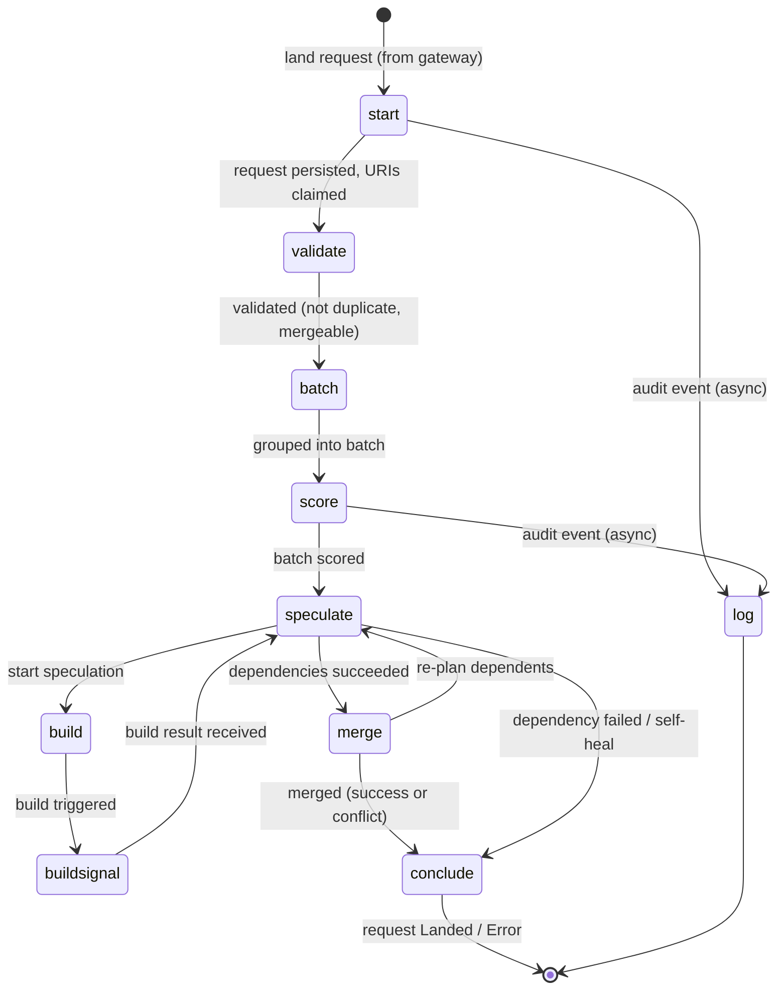

# SubmitQueue Orchestrator

The orchestrator drives a request through a pipeline of queues (topics). Each queue
is consumed by one step controller that does its work and publishes to the next
queue. Processing is at-least-once; controllers are idempotent and retry on failure.

## Pipeline state machine

Each state below is a queue (topic); each edge is a publish from one stage to the
next, labelled with what triggers the transition.

Notes:

- **Feedback loops:** `buildsignal` and `merge` both re-publish to `speculate`, which
  is a state machine that advances a batch one step per delivery (waiting on
  in-flight dependencies, then merging or failing).
- **Self-healing:** `speculate` and `merge` re-fan-out to `conclude` when a batch is
  already terminal, covering any publish that was lost under at-least-once delivery.
- **`log`** is an async audit sink fed by stages as they progress (currently `start`
  and `score`); it persists request-log entries and does not feed back into the
  pipeline.
